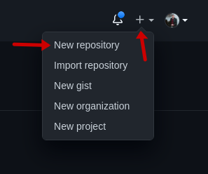

# Tutorial de Git/Github

## 1. Instalação
- Para baixar o git acesse [aqui](https://git-scm.com/downloads)
- Após terminar o download, execute o arquivo e basta selecionar next até o fim
- Após instalado o Git, abra o terminal e rode `git --version` para verificar se o git foi instalado. Caso apareça a versão significa que foi devidamente instalado.

## 2. Configuração inicial
O git necessita de uma pequena instalação inicial, que só é necessária na primeira utilização.

Para realizar essa configuração rode os dois comandos abaixo no seu terminal:

- `git config --global user.name "Your Name"`
- `git config --global user.email "youremail@yourdomain.com"`

>Lembre de alterar ***Your Name*** por seu nome e ***youremail@yourdomain.com*** pelo seu e-mail que você criou a conta no github.

## 3. Criando seus primeiros commits
Agora que o git já está instalado, podemos fazer o primeiro commit seguindo o passo a passo abaixo:
> Antes de seguir com esse tutorial, certifique-se de já possuir uma conta no github e o git no seu computador estar instalado e configurado corretamente.

- Acesse seu github e logue-se
- Crie um novo repositório de acordo com as imagens abaixo:

 

  
  
  

 

- Quando você criar aparecerá uma tela parecida com a tela abaixo:

 

 
 

- Abra o seu terminal, crie e navegue para uma pasta vazia que será seu projeto
- Com a pasta do seu projeto aberta no terminal, abra a pasta no VS Code com o comando `code .`
- No VS Code crie um arquivo chamado `readme.md`
- Digite seu readme seguindo os padrões do [markdown](https://github.com/adam-p/markdown-here/wiki/Markdown-Cheatsheet)
- No terminal e rode o comando `git init`
- No terminal e rode o comando `git add .`
- No terminal rode o comando `git commit -m "adicionando readme"`
- No terminal rode o comando `git remote add origin LINK_DO_SEU_REPOSITORIO`, veja na imagem abaixo como copiar o código para facilitar:
 

 

- No terminal rode o comando `git push origin master`, caso não funcione rode o comando `git push origin main`
> O Github está substituindo o repositório master por main aos poucos, por isso às vezes um repositório novo é criado como master e às vezes como main
